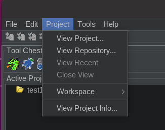

Open the destination database first (shared or local)

On dropdown menu click `Project` and select
- `View Project` for local repository
- `View Repository` for shared repository

It will open the second repo as READ-ONLY. Drag and drop the files you want to add to the destination repo.

Close the view by clicking the X in the tab on the bottom right of the file tree